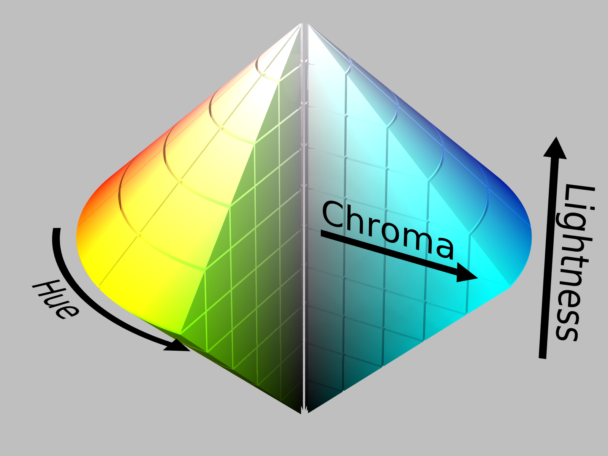
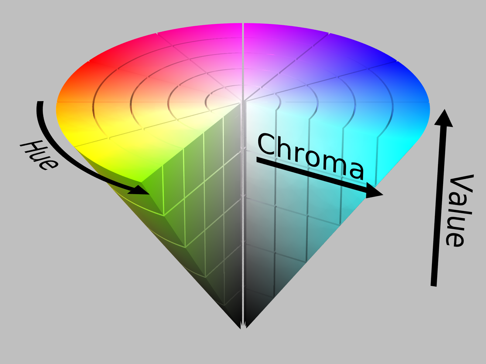

# Colorspaces

#### A simple Swift library allowing for the easy creation and manipulation of colors throughout various colorspaces.

#### This library is made available as a Swift Package. To use it as a dependency in your project [see this documentation from Apple.](https://developer.apple.com/documentation/xcode/adding_package_dependencies_to_your_app)

  

Features:
- `RGBColor`, `HSLColor`, `HSBColor` classes for easy creation of whatever colors you like.
- Built-in conversions in all of the above classes, as well as to Hex strings & `UIColor` objects.
- Convenience `distance` function to calculate the euclidean distance between any two `RGBColors`.
- Color scheme generation functions, allowing you to create the following types of schemes for any `RGBColor`, `HSLColor` or `HSBColor`:
    * Monochromatic
    * Complimentary
    * Split-Complimentary
    * Analogous
    * Triadic
    * Tetradic

For more information on the theory behind this library, check out [this page on Color Models](https://en.wikipedia.org/wiki/Color_model), and [this page for more detailed information on the colorspaces used in this library and the conversion math involved](https://en.wikipedia.org/wiki/HSL_and_HSV).

